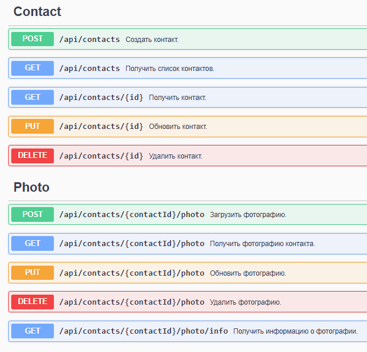

# BirthdayManager 🎂



## 📋 Описание

BirthdayManager - это **веб-API**, которое позволяет:

- Создавать и управлять контактами с информацией о днях рождения
- Организовывать контакты по типам (знакомые, родственники, друзья, коллеги)
- Загружать и хранить фотографии контактов

## 🚀 Быстрый старт
### С Docker
```bash
git clone https://github.com/PavelDikunets/BirthdayManager.git
```
```bash
cd BirthdayManager
```
```bash
docker-compose up -d
```

API: `http://localhost:8080`  
Swagger: `http://localhost:8080/swagger`

### Без Docker
- Установить .NET 8 SDK
- Установить PostgreSQL 
- Обновить строку подключения в `appsettings.json`
- Запустить:
```bash
cd src/BirthdayManager/Host/BirthdayManager.Host.Api
```
```bash
dotnet run
```

API: `http://localhost:5033`  
Swagger: `http://localhost:5033/swagger`

## 🛠️ Технологический стек
- **.NET 8**
- **ASP.NET Core**
- **FluentValidation**
- **Entity Framework Core**
- **PostgreSQL**
- **Docker**
